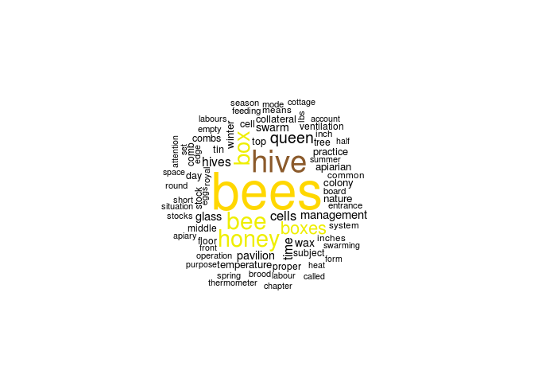

U.S. Neonicotinoid Use and Impacts on Honeybee Survival and Productivity
================
Erin Moyer
1/23/2019

Introduction
------------

Neonicotinoids are a type of insecticide sprayed in urban areas and on agricultural fields. While the purpose of dispersing neonicotinoids is to eliminate pesky insects that may harm plant or human life otherwise, neonicotinoids may execute similar effects on other non-target species. Rising concern is emanating from scientists and environmentalists alike as bee populations dwindle in the face of these toxic substances. Recent research suggests that neonicotinoids are causing behavior changes, reduced fertility, decreased immune function, and ultimately, death in the bee population. My goal is to find data for this phenomena and create effective visualizations to convey the urgency in which significant reevaluation of the future use and regulation of these chemicals is necessary. The data used for this project includes information on neonicotinoid insecticide use and the number of honeybee colonies and honey production-related statistics for (most) U.S. states from 1991 to 2017. The data was compiled from National Agricultural Statistics Service (NASS) and the United States Geological Survey (USGS), but I downloaded it from Kaggle. The map data was taken from library(usmap).

Exploratory Graphs
------------------

``` r
#An overlook at the use of neonicotinoids for each state over the past three decades.
ggplot(HoneyNeonic, aes(year, nAllNeonic))+ geom_point()+facet_wrap(vars(state), scales= "free")
```

    ## Warning: Removed 243 rows containing missing values (geom_point).


``` r
#An overlook at the number of honeybee colonies for each state over the past three decades.
ggplot(HoneyNeonic,aes(year, numcol)) + geom_point()+facet_wrap(vars(state), scales= "free")
```

    ## Warning: Removed 6 rows containing missing values (geom_point).


``` r
#An overlook at the total honey production for each state over the past three decades.
ggplot(HoneyNeonic,aes(year, totalprod)) + geom_point()+facet_wrap(vars(state), scales= "free")
```

    ## Warning: Removed 6 rows containing missing values (geom_point).


``` r
#These graphs are not helpful at all. I have too many neonicotinoid values on the lower end of the spectrum to be useful. Also, some states have less bee colonies than others because they have less agricultural land and therefore less need to raise honeybee colonies. 
ggplot(HoneyNeonic,aes(nAllNeonic,log(numcol)))+ geom_point()
```

    ## Warning: Removed 243 rows containing missing values (geom_point).


``` r
ggplot(HoneyNeonic,aes(nAllNeonic, totalprod))+ geom_point()
```

    ## Warning: Removed 243 rows containing missing values (geom_point).


Cleaning the Data
-----------------

``` r
#Had to munually enter a few missing states (in original Excel spreadsheet) in conjuction with this complete command to fill in missing states.
HoneyNeonic <- complete(HoneyNeonic, year, StateName)
#Converts state names to lower case, trims extra space, and renames colomn to "region" to match the entries in the states data.
HoneyNeonic1 <- mutate(HoneyNeonic, region = str_to_lower(StateName)%>% str_trim(side="both"))
#Adds coordinate information to my bee data for future mapping purposes. 
HoneyNeonic2 <- full_join(states, HoneyNeonic1, by = "region")
#Had to tidy up a few things. Gathered all the types of neonicotnoids into one colomn and their values into the other. This way I can filter by type of neonicotinoid. Also got rid of the pesky "n" in front of each of the names and a bunch of variables I don't care about for this project. 
Tidy_Honey <- gather(HoneyNeonic2, key = "Name", value = "Amount", c(18:23), na.rm = FALSE) %>% mutate(Neonicotinoid = str_remove(Name, pattern = "^n")) %>% select(c(1,2,3,5,7,10,11,12,19,20))
#Bam it's official now. Saved as a csv file.
write_csv(Tidy_Honey, "/home/erin.moyer/Honeybee/Hunnybee/Tidy_Honey.csv")
```

Fun With Maps
-------------

``` r
#Produces map of U.S. with each state colored by it's neonicotinoid use for the given year. Recreated this in a shiny app where the year and the type of neonicotinoid can be selected for.
Filtered_Honey <-filter(Tidy_Honey, year == 2010, Neonicotinoid == "AllNeonic")
    Filtered_Honey %>% ggplot() + geom_polygon(aes(x=long, y=lat, group = group, fill = Amount)) + scale_fill_continuous(low = "thistle2", high = "darkred", na.value = "white", guide="colorbar")
```


Getting Mean
------------

I decided that the decline in number of colonies and total honey yield would be most visible with a basic line plot, so I created new data colomns for the mean number of colonies and mean total honey production per year for the entire U.S. and plotted them together (see shiny app). I would include the mean neonicotinoid amount data per year, but I would have to revert back to the original data set before the gather, which sounds like a pain when it comes to putting these elements together on a graph. Plus I don't have a third y-axis to work with labeling. I think I'll stick to my map visualization for the neonicotinoids.

``` r
#Creates graphs of mean number of colonies and mean total honey production per year.
mean.honey <-Tidy_Honey %>% group_by(year) %>% summarise(colonies=mean(numcol, na.rm = TRUE), honey=mean(totalprod, na.rm = TRUE))
ggplot(mean.honey, aes(x=year, y=colonies))+ geom_point()
```

    ## Warning: Removed 1 rows containing missing values (geom_point).


``` r
ggplot(mean.honey, aes(x=year, y=honey))+ geom_point()
```

    ## Warning: Removed 1 rows containing missing values (geom_point).


``` r
write_csv(mean.honey, "/home/erin.moyer/Honeybee/Hunnybee/Mean_Honey.csv")
#Plot of mean neonicotinoid use by year just for the heck of it.
mean.neonic <- HoneyNeonic2 %>% group_by(year) %>% summarise(mean=mean(nAllNeonic, na.rm = TRUE))
ggplot(mean.neonic, aes(x=year, y=mean))+ geom_point()
```

    ## Warning: Removed 5 rows containing missing values (geom_point).


Creating a Word Cloud
---------------------

Because word clouds are cool.

``` r
library(gutenbergr)
library(tidytext)
library(wordcloud)
```

    ## Loading required package: RColorBrewer

``` r
#Retrieves words from The Behavior of the Honey Bee in Pollen Collection by Dana Brackenridge Casteel
bee<-gutenberg_download(58229)
```

    ## Determining mirror for Project Gutenberg from http://www.gutenberg.org/robot/harvest

    ## Using mirror http://aleph.gutenberg.org

``` r
##Removes whitespace, punctuation, and capitalization.
beeWords<-unnest_tokens(bee, word, text)
##Removes filler words.
beeWords2<-anti_join(beeWords, stop_words)
```

    ## Joining, by = "word"

``` r
#Counts number of time each word appears in the text.
beeWRCount<-beeWords2 %>% count(word) %>% ungroup() 
##Removes numbers.
nonum <- beeWRCount[-c(1:151),]
##Because if we're talking about bees we have to use bee colors.
beecolor<-c("black", "yellow2", "tan4", "gold")
##This is reproduced in the shiny app using the csv file Bee_Word.
wordcloud(nonum$word, nonum$n, random.order=FALSE, max.words=75, colors=beecolor)
```



``` r
write_csv(nonum, "/home/erin.moyer/Honeybee/Hunnybee/Bee_Word.csv")
```

Shiny App
---------

<https://erinmoyer.shinyapps.io/Hunnybee/>
